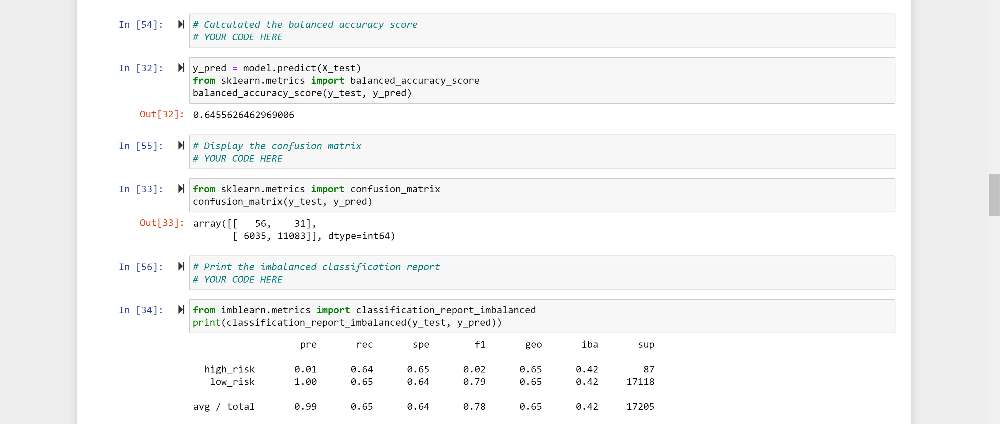
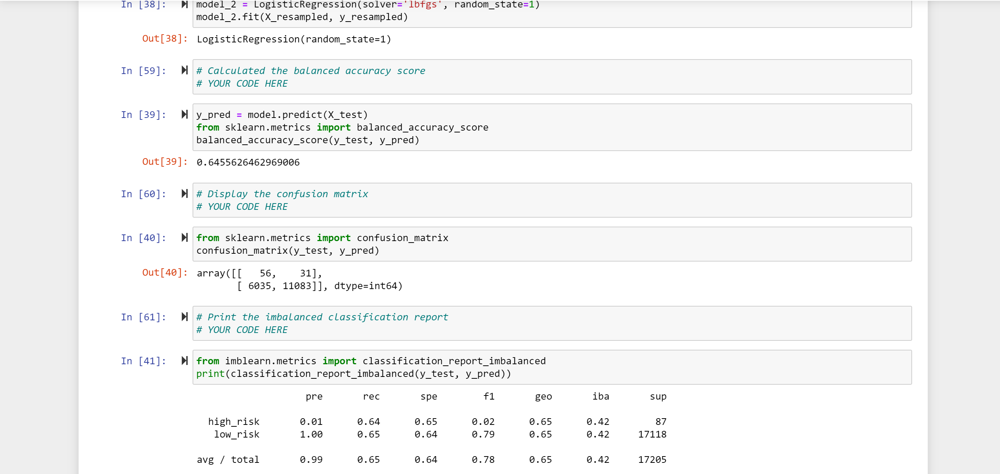
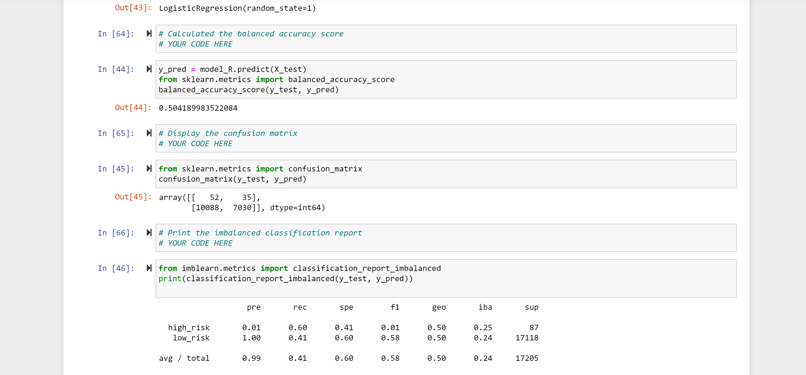
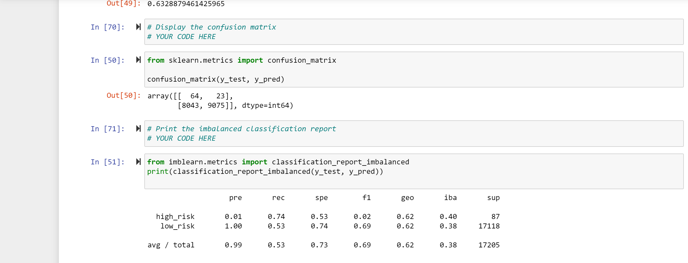
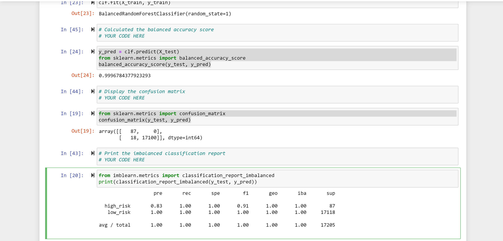
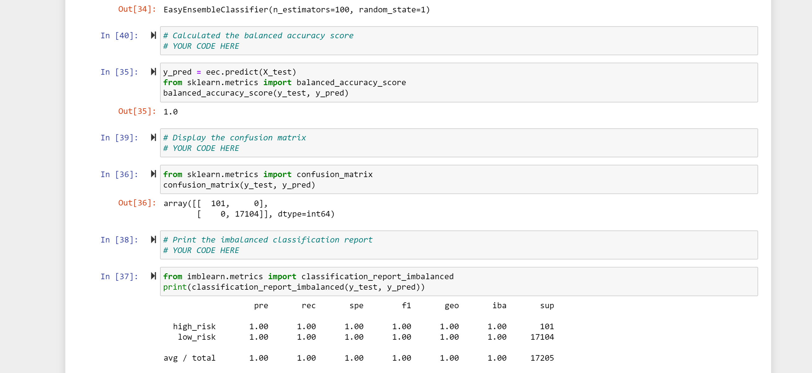

# Credit_Risk_Analysis

## Overview of the analysis

The purpose of this analysis is to build and evaluate several (six) machine learning models algorithms to predict credit risk. Once the algorithms were designed and implemented, the performances were evaluated.

### Results

#### balanced accuracy scores, precision and recall scores of ****Naive Random Oversampling****

#### balanced accuracy scores, precision and recall scores of ****SMOTE Oversampling****

#### balanced accuracy scores, precision and recall scores of ****Undersampling****

#### balanced accuracy scores, precision and recall scores of ****Combination (Over and Under) Sampling****

#### balanced accuracy scores, precision and recall scores of ****Balanced Random Forest Classifier****

#### balanced accuracy scores, precision and recall scores of ****Easy Ensemble AdaBoost Classifier****

### Summary

Based on the algorithm designed, the accuracy scores, precision and classification reports for each algorithm was checked. 

The naive random oversampling has a precision of 0.99 and an f1 score of 0.78.

The SMOTE oversampling has same values as the naive random oversampling.

Undersampling on the other hand has a precision value of 0.99 and an f1 score of 0.58

WHile combination sampling has a precision value of 0.99 and an f1 score of 0.69.

Balanced random forest classifier has a precision value and f1 score of 1.0, however the high_risk target has a precision value of 0.83 and f1 score of 0.91

The Easy Ensemble AdaBoost Classifier has a precision value and f1 score of 1.0 on both high_risk and low_risk targets.

Based on the following algorithms, I will recommend the Easy Ensemble AdaBoost Classifier.
